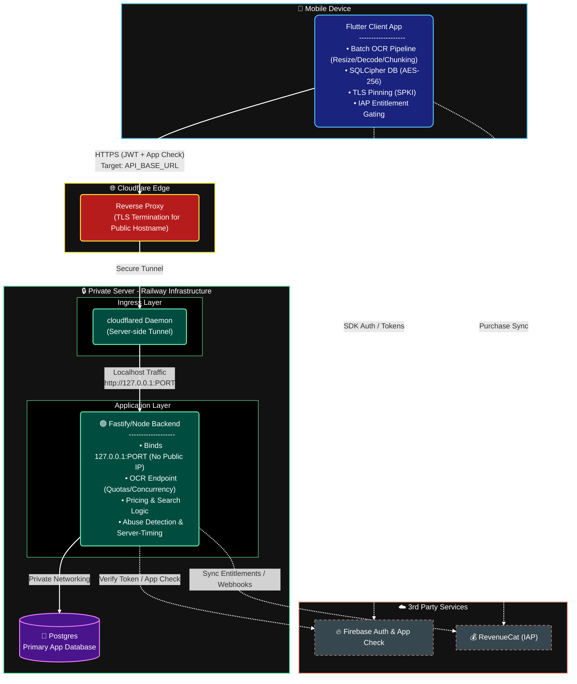

# CardNest — Offline-First Secure Trading Card Manager (Architecture Case Study)

- Role: Sole developer (with AI coding agent)
- Timeline: 2025-07 → 2025-10
- Status: Private repo, unpublished app (internal TestFlight used)

## Summary
Cross‑platform Flutter app for managing trading card collections with batch OCR, secure offline storage, and a Fastify/Node backend. The system emphasizes privacy and security (SQLCipher at rest, App Check + JWT in transit, SPKI/TLS pinning), with pricing aggregation, quota/rate controls, and encrypted backups.

## Architecture (At a Glance)

## Key Problems → Solutions

- OCR throughput under variable mobile networks (distinct from accuracy)
  - Solution: Client pipeline resizes images to a 1536px long‑side cap (native HEIC/AVIF decode; JPEG quality tuning), then sends chunked batches (5 images/chunk) with up to 4 parallel requests. Backend enforces per‑user inflight caps (max 20 images) and processes images concurrently per batch (tier‑based concurrency, env‑tunable). Progressive timeouts and limited retries keep tail latency bounded; request body capped to prevent oversized uploads.
  - Impact: Single card ~4–8s; 20‑card batch ~20–40s at ~20–30 Mbps; fewer timeouts; predictable end‑to‑end latency under load.

- Recognition accuracy and duplicate prevention (separate from throughput)
  - Solution: Structured extraction (JSON mode) feeding candidate retrieval with lightweight heuristic scoring; optional vision re‑ranking among top‑K image candidates with confidence gating; exact‑match DB lookup by `langId`; and “withhold on ambiguity” to avoid incorrect saves. Local DB dedupe prevents duplicates; user‑facing messages localize OCR errors.
  - Impact: Precision ≈ 99%, Recall ≈ 97% on internal test set; reduced dupes and clearer UX on ambiguous results.

- Multilingual data normalization and search quality
  - Solution: Offline ingestion and normalization of card data across languages with deterministic canonical IDs, conflict detection/resolution rules, and idempotent, repeatable scripts/tests to keep the dataset consistent.
  - Impact: Higher‑quality OCR candidate sets and better search recall/precision across languages; fewer mismatches and cleaner UX.

- Security across client, network, and server
  - Solution: Client — SQLCipher‑encrypted DB (AES‑256), secure PIN (PBKDF2), TLS pinning, env‑based config (no secrets in repo). Network — Cloudflare Edge + server‑side Tunnel (no public ingress), strict CORS, hardened security headers. Server — Firebase Auth + App Check verification, per‑user quotas and concurrency limits, request size caps, suspicious‑usage flags, and structured logging. Backups — encrypted every 4 hours with 7/4/12 retention and scripted restore.
  - Impact: Reduced attack surface, protected user data at rest/in transit, predictable resource usage under load, and fast recovery (RPO ≈ 4h).

## Results & Metrics (internal testing)
- OCR accuracy: Precision ≈ 99%, Recall ≈ 97% (test set) 
- Latency: Single card ~4–8s; 20‑card batch ~20–40s with ~20–30 Mbps uplink
- Backups: Encrypted every 4 hours; 7/4/12 retention strategy (daily/weekly/monthly)
- Distribution: Internal TestFlight builds used for testing

## Security Posture
- Data at rest: SQLCipher (AES‑256), generated key material, schema migrations
- Data in transit: TLS pinning (SPKI), Firebase Auth + App Check verification on backend
- Edge/tunnel trust: Backend binds to 127.0.0.1 and is reachable only via a server‑side Cloudflare Tunnel; client connects to a Cloudflare‑proxied hostname. Strict CORS allowlist and optional edge/tunnel header checks further constrain origin access.
- Secrets/config: Build‑time environment values (no secrets in repo)
- Backups: Client‑side GPG AES‑256 encryption; tiered retention; restore scripts
- Headers/hardening: Strict response security headers and CORS whitelist

## UI/UX Highlights
- Batch OCR flow: camera/upload → client‑side preprocessing → results with exact match/high‑confidence picks, clear “withheld/ambiguous” states, and localized error messages. Progress and quota state surfaced to set expectations.
- Condition/grade workflows: interactive drawer for condition selection (incl. graded services), multi‑quantity, and live market value summary; consistent dialogs for grading details and edits.
- Collections management: reusable Advanced Filter dialog, filter chips, bulk actions, and at‑a‑glance collection stats; polished list/detail screens.
- Theming and consistency: custom theme extensions (`lib/core/theme/*`) and design tokens drive colors/typography; cohesive “card” visual style across screens.
- Premium gating: entitlement‑aware UI (paywall and feature guards) that appears only when enabled via feature flags; seamless transitions between free/Plus/Pro experiences.

## Deployment & Ops
- CI/CD: Documented iOS builds (unsigned/signed IPA) with optional TestFlight upload
- Runtime: Backend deployed with private networking and exposed only via a secure tunnel (no public ingress)
- Observability: Server‑Timing headers, structured logs, and optional DB timing logs
- Backups/Restore: Automated encrypted backups and one‑command restore

## Tech Stack
- Flutter/Dart, Firebase Auth/App Check, SQLCipher (sqflite_sqlcipher)
- Fastify/Node.js, Postgres, RevenueCat
- Cloudflare Tunnel, Railway, Backblaze B2 (encrypted backups)

## Screenshots (to be inserted before export)
Include 3–5 images with short captions (blur any sensitive data):
- OCR capture → result match
- Condition/grade drawer and market summary
- Collections list with filters/analytics
- Pricing/entitlement UI (if relevant)

## Future Work / Status
- App completeness ≈ 90%
- Remaining: Automated card info/price update script, app store review/publishing steps
- Project paused for now

## Access
- Private repository and unpublished app
- Demo/video and selective code excerpts available on request
- Internal TestFlight build available for reviewers (by invite)
